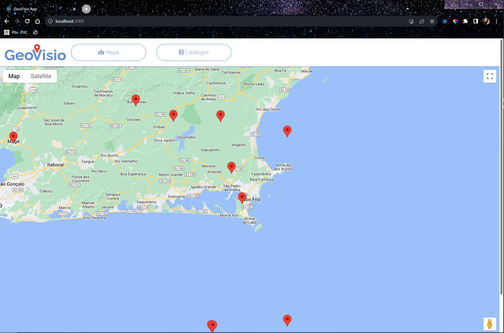
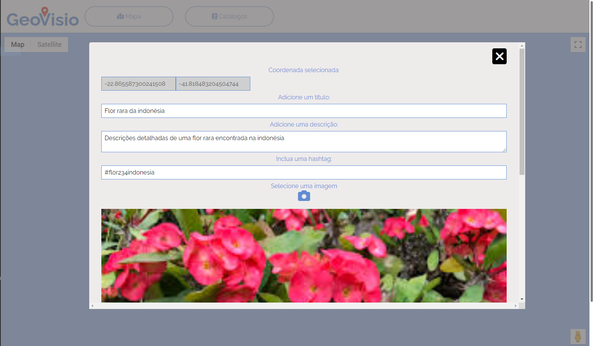
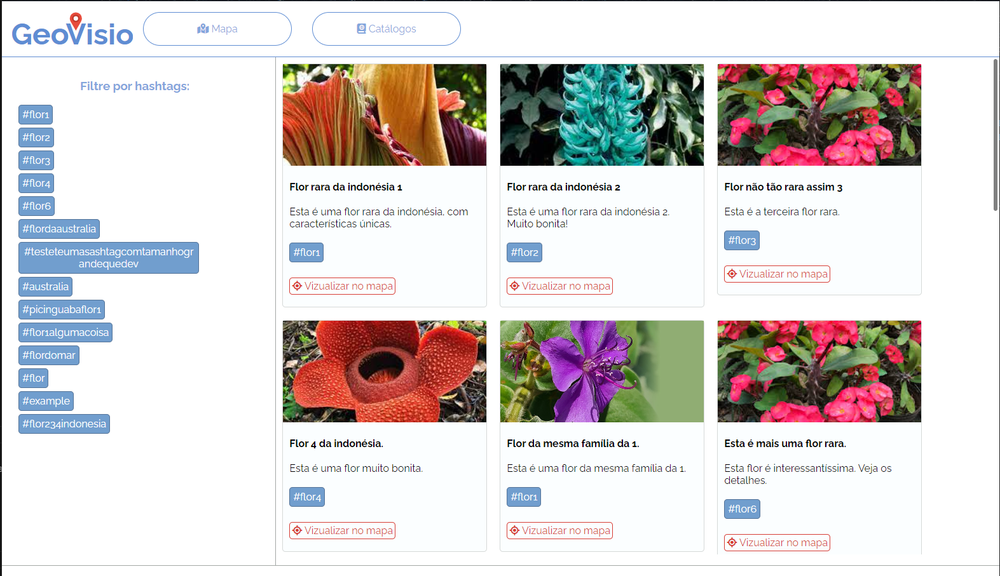

# GeoVisio APP

  

Este APP tem por princípio realizar a **manipulação de dados** com **base geográfica**.

  

À partir de **coordenadas** obtidas à partir do mapa, é possível cadastrar itens que são chamados de **catálogos geográficos**.
  

## Qual é a aplicação deste app?

  

Se você possui qualquer tipo de **dado georreferenciado**, é possível utilizar para **associar informações** do seu negócio à essas **coordenadas**.

  

É aplicável às áreas de:

- Agro (mapeamento de safras, escoamento, status de lavouras);

- Petróleo (mapeamento de dados sobre extração e/ou potencial extração);

- Geológico (mapeamento de terreno);

- Biológico (catalogação de fauna, flora, etc.)

- Mobilidade (transportes, pontos de taxi, ônibus, etc.)

- Saúde pública (mapeamento de UBS, ações de vacinação por região)

- Segurança (tático, policial, criminalidade)

- Defesa Civil (Pontos de alagamento, risco de barrancos, etc.)

  

Funciona da seguinte forma:

1. Para cada **coordenada** cadastrada, é possível cadastradar um ou vários **catálogos**.

2. Cada catálogo possui **título, descrição, hashtag, imagem** e estará **associada à uma coordenada**.

3. Dada uma **hashtag**, é possível **filtrar catálogos** que utilizam essa hastag.

  

## Como executar

### APP React

- Este projeto foi criado com [Create React App](https://github.com/facebook/create-react-app).

- Após clonar o repositório, certifique-se que tenha instalado o [node.js](https://nodejs.org/en).

- Este projeto utiliza a **Google Maps JS API**. Para que o mapa funcione, será necessário adicionar uma chave de API do Google.

    1. Se você quiser criar uma chave própria, siga essas instruções presentes [aqui](https://support.google.com/looker-studio/answer/10988075?hl=pt-BR).
    2. Se você for utilizar a chave disponibilizada por mim, ela estará disponível até **30/07/2024** e está restrita à funcionar apenas no link [http://localhost:3000](http://localhost:3000). Portanto, a app deve estar aberta apenas nesse link.
    3. Adicione a chave em **src>components>Map.jsx**, linha 23:

```
  const { isLoaded } = useJsApiLoader({
    id: 'google-map-script',
    googleMapsApiKey: "YOUR_KEY_HERE"
  })
```
- Este projeto utiliza a **Weather API** como API externa. Para ativar as requisições é preciso adicionar a chave no arquivo . A documentação se encontra no site oficial [www.weatherapi.com](https://www.weatherapi.com/)

## Scripts

Este projeto utiliza docker para sua execução. O docker-compose.yml foi enviado na plataforma de estudos. Para rodá-lo, utilize o comando:

### `docker-compose up --build`
Para instalar as dependências do projeto frontend (React) e backend (Flask, Python)

Roda o app no modo desenvolvimento.\
Abra [http://localhost:3000](http://localhost:3000) para ver ele funcionando no Brownser.
> Para rodar o app, é preciso que a **geovisio_api** esteja funcionando na rota [http://localhost:5000](http://localhost:5000)!
[Link para o repositório do Github do geovisio_api](https://github.com/LucyEster/geovisio_api)

## Imagens

### Aba Mapa



### Cadastro de catálogo



### Aba Catálogos



## Saiba Mais

Veja a documentação:

- [Create React App docs](https://facebook.github.io/create-react-app/docs/getting-started).

- [React documentation](https://reactjs.org/).
